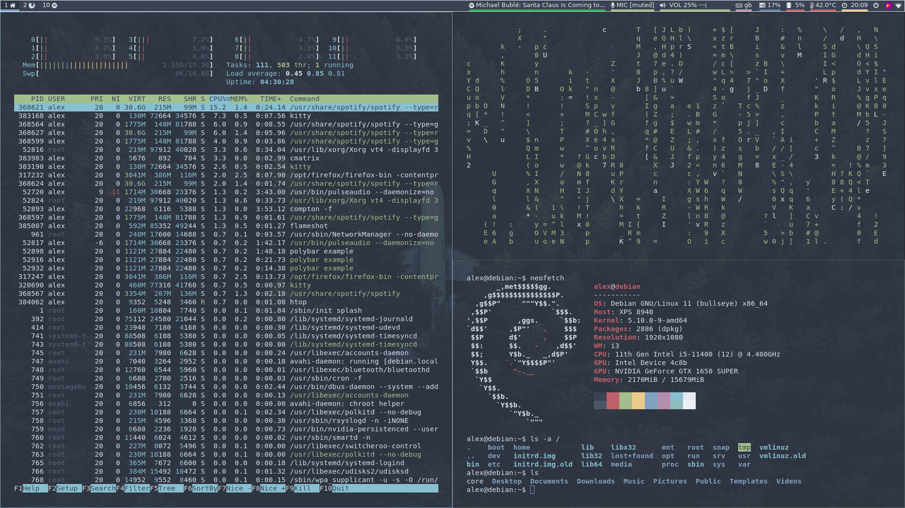
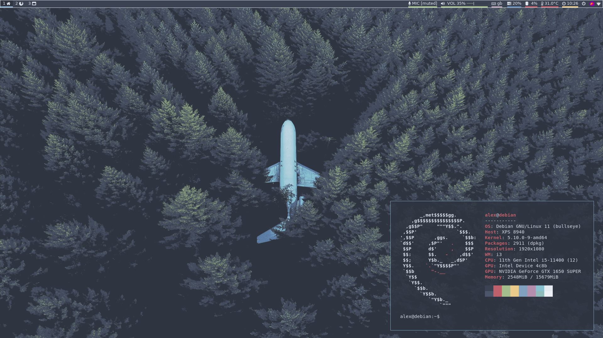

# dotfiles

This is my personal i3 rice based on the [Nord Colour Scheme](https://nordtheme.com).

## Usage
Place the configs you want to use into your ~/.config directory. You may need to remove and backup your previous config files.

> cp dotfiles/polybar/ ~/.config/

If you face any issues, make sure the filepaths referenced in the config files match the ones on your system, and make sure you have all of the installable dependencies listed below or replace them with your own.

I've probably left some '/home/alex' paths in, so just change those to '/~' or '/home/[usrname]'

## Dependencies for the exact configuration
- [FontAwesome](https://fontawesome.com) (bar icons)
	> sudo apt install fonts-font-awesome
- [i3wm](https://i3wm.org) (window manager)
	> sudo apt install i3
- [Polybar](https://polybar.github.io) (status bar)
	> sudo apt install polybar
- [Rofi](https://github.com/davatorium/rofi) (launcher)
	> sudo apt install rofi
- [Compton](https://github.com/chjj/compton) (compositor for window transparency
	> sudo apt install compton
- Nitrogen (wallpaper manager)
	> sudo apt install nitrogen
